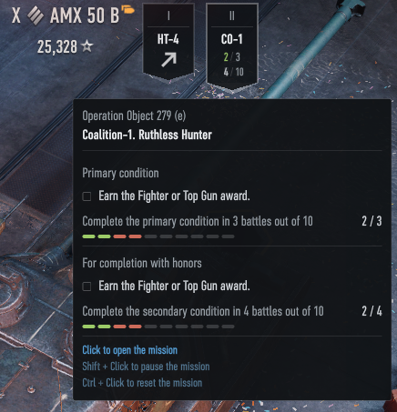
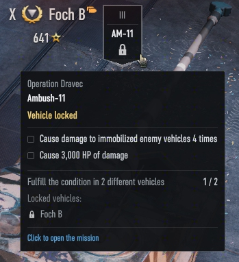

# Zanju's Campaign Tracker

### This mod brings back the personal mission campaign banners the UI rework removed.

- **Support for all campaigns** — works with the old style of campaigns 1 and 2, and the new style of campaign 3.
- **Details on hover** — hover over a banner for the conditions and your progress.
- **Interactive** — click a banner to open its mission. Shift-click and Ctrl-click pause or reset the missions that allow it.
- **Locked vehicles** — for missions that require several different vehicles, shows the progress and warns when your tank is locked out.

## Translations

Reference language `en` defines 11 strings. Translations are community-maintained and may lag behind; see [Translating](../../docs/translating.md) to add or update one, then regenerate this table with `zwm lint i18n`.

| Language | Coverage | Missing |
| --- | --- | --- |
| _none yet_ | — | — |

## Install And Use

If you already have the prepared mod zip file, follow the general install path in [Installing Mods](../../docs/installing-mods.md).

## Build From Source

For the general build/toolchain workflow, see [Building From Source](../../docs/building-from-source.md).

## Develop

For the wider repository workflow, see:

- [Developing Mods](../../docs/developing-mods.md)
- [Architecture](../../docs/architecture.md)
- [Technical Reference](../../docs/reference/README.md)
