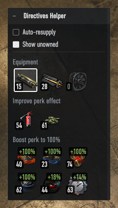

# Zanju's Directives Helper

### Fit any directive your tank can take, from one small garage window.

The game will happily tell you about directives one panel at a time, several clicks deep.
This mod puts the whole picture in a small garage window and lets you act on it there:

- **What you can actually fit** — every directive in your depot that works on the tank you
  have selected, as a grid of the game's own icons with their counts. Anything the tank
  cannot take is left out rather than shown greyed.
- **What each one will do** — three sections, because a crew directive's effect depends on
  the crew in the tank: **Equipment**, **Improve perk effect** (the perk is already trained
  to 100%) and **Boost perk to 100%** (it is not). In that last section each icon also shows
  what it is worth on *this* crew — `+70%` when they have the perk trained to 30% — so a
  directive that would barely move the needle is obvious at a glance.
- **Click to fit** — clicking a directive mounts it on the currently selected loadout,
  swapping out whatever was there. The fitted one is outlined; clicking it takes it off.
- **Auto-resupply** — a checkbox at the top of the window for whether this tank refills its
  directive after a battle. It warns you when the directive you have fitted is your last one,
  because that is when resupply stops taking from the depot and starts buying a replacement.
  The warning also marks the title bar, so a folded window still shows it.

- **Shopping list** — a second checkbox adds the directives that fit your tank but that you own
  none of. Those are dimmed, and clicking one opens the game's own purchase dialog — price,
  quantity and all — so nothing is ever spent without you confirming it there. A reward-only
  directive that cannot be bought is still listed, but says *purchase not available* instead
  and does nothing when clicked.

Hover a directive to see its name. The window can be **moved** by dragging its title bar,
**resized** by dragging its right edge, and **folded** away to just the bar by clicking it.
The position, width, folded state and both checkboxes are remembered between sessions.

Resizing changes the width only: the icons are a wrapping grid, so a wider window fits more
per row while the height simply follows what is in it.

One thing worth knowing, because the numbers look odd otherwise: fitting a directive
**takes it out of the depot**. A directive you own 6 of will read as 5 while one of them is
mounted — that is the game's own accounting, not a miscount here.

## Translations

Reference language `en` defines 10 strings. Translations are community-maintained and may lag behind; see [Translating](../../docs/translating.md) to add or update one, then regenerate this table with `zwm lint i18n`.

| Language | Coverage | Missing |
| --- | --- | --- |
| `pl` | 100% (10/10) | 0 |

## Install And Use

If you already have the prepared mod zip file, follow the general install path in
[Installing Mods](../../docs/installing-mods.md).

## Build From Source

For the general build/toolchain workflow, see
[Building From Source](../../docs/building-from-source.md).

## Develop

For the wider repository workflow, see:

- [Developing Mods](../../docs/developing-mods.md)
- [Architecture](../../docs/architecture.md)
- [Technical Reference](../../docs/reference/README.md)

### Where the data comes from

"Directive" is the player-facing name; internally they are **battle boosters**
(`GUI_ITEM_TYPE.BATTLE_BOOSTER`) — equipment artefacts, which is why they share the account
inventory's equipment section rather than having one of their own.

- **Depot** — `itemsCache.items.getItems(GUI_ITEM_TYPE.BATTLE_BOOSTER, ...)`, filtered to what
  is actually owned unless the "show unowned" option is on.
- **Buying** — `event_dispatcher.showBattleBoosterBuyDialog(intCD)`, which opens the client's
  own `BoosterBuyWindowView`: price, quantity selector and auto-resupply toggle, buying through
  `ModuleBuyer` only once the player accepts. Deliberately not a silent buy-and-install — and
  the install processor's validators reject an unowned directive anyway, so fitting one was
  never an option. Falls back to the store page if the dialog cannot be opened.
  - A directive with no buy price never reaches that dialog: it divides by both the current and
    the default price, to size the quantity selector and to work out the discount, so a
    reward-only item would raise `ZeroDivisionError` inside the game's own view.
- **Crew vs equipment** — `item.isCrewBooster()`, the same test behind the game's own two
  directive tabs.
- **Fitted** — `vehicle.battleBoosters.installed`.
- **Fits this tank** — `item.isAffectsOnVehicle(vehicle)`, which validates crew directives
  against the crew's skills and equipment directives against the mounted optional devices.
- **What a grant-perk directive is worth** — how far short of a full perk the crew currently
  is, since fitting one takes it the rest of the way. See below; it is the one figure here the
  mod works out rather than reads.
- **Auto-resupply** — `vehicle.isAutoBattleBoosterEquip()`, a bit in the vehicle's inventory
  settings (`VEHICLE_SETTINGS_FLAG.AUTO_EQUIP_BOOSTER`), so it is per vehicle rather than
  account-wide. Toggling it runs `VehicleAutoBattleBoosterEquipProcessor`, the same processor
  behind the game's own checkbox on the tank setup screen.

### Working out the `+N%`

A perk does not belong to a tankman as far as the readout is concerned — it belongs to the
crew. `Tankman.crewMemberRealSkillLevel` averages the perk over every seat it applies to, and
a seat that has not trained it counts as a zero in that average rather than being left out.
Two loaders where one has Melee Master at 100% and the other has never touched it is a crew at
50%, not 100%.

That is the number the mod starts from, read with `shouldIncrease=False`. The flag matters:
the default folds a fitted booster's own contribution into the level, which would measure the
gain against a value that already includes the thing being offered.

Fitting the directive takes that average to a full 100%, so the gain is simply the remainder —
`MAX_SKILL_LEVEL` minus the current level, rounded up.

The tempting mistake is to think the directive only reaches the seats that could learn the perk
themselves, and so scales down on a crew where some tankmen are already carrying the maximum
number of perks. It does not: the effect is full whatever the crew looks like. The client's own
code says the same thing — follow `crewMemberRealSkillLevel` into `_boostSkill` with a booster
installed and it takes the branch `MAX_SKILL_LEVEL if skillLevel <= 0 else skillLevel`, which
promotes *every* seat sitting at zero to a full perk, gated only on at least one seat being able
to use the booster at all (`tankmansCantUseBoosterCnt != len(tankmenSkillLevels)`).

The perk cap does still decide whether a directive is worth anything on this tank, but that
question is asked and answered before the gain is: `isAffectsOnVehicle` is
`any(TankmanDescr.validateSkillEquipment(...))` across the crew, and `validateSkill` raises on
`len(self.skills) >= NPS.MAX_MAJOR_PERKS` — so a directive no tankman has room for is filtered
out of the window entirely rather than listed with a reduced figure.

### When the window shows

Two conditions, from two different sources, and the window needs both.

**Does this mode offer directives at all?** It follows the garage's loadout panel — the bar
holding shells, consumables, optional devices and directives — by patching `LoadoutPresenter`,
which every mode's panel subclasses. The panel's presenter is alive exactly while the bar is on
screen, and its groups controller (`_getGroupController._getGroups()`) lists the sections the
bar carries; the answer is yes when a panel is up and `battleBoosters` is one of its sections.
This covers modes that decide at runtime: Fun Random enables directives per sub-mode, Last
Stand per panel preset.

**Is the garage what the player is actually looking at?** The panel cannot answer this, and
that is not a flaw in it — opening the playlist editor, the directives screen or the equipment
screen does not tear the garage down, so the panel underneath stays alive and quite correctly
goes on reporting that this mode offers directives. What changes is the lobby's visible route,
which is the client's own record of the current screen:
`LobbyStateMachine.onVisibleRouteChanged` carries the state that just became visible, and its
`getStateID()` is the route path — the same string the client writes to `python.log` as
"Visible route changed to: …". The window shows when nothing is layered over the garage:

| Route | |
| --- | --- |
| `subScope/subLayer/hangar/{root}` | shown |
| `subScope/subLayer/comp7Light/hangar/{root}` | shown — Onslaught |
| `subScope/subLayer/hangar/editVehiclePlaylists` | hidden |
| `subScope/subLayer/hangar/loadout/instructions` | hidden |
| `subScope/subLayer/hangar/loadout/equipment` | hidden |

Read as a suffix rather than matched against a list. An allowlist would silently omit every
mode nobody thought to add, since each one prefixes the route with its own subtree; and the
client's own consumers of this event compare against `getStateByCls(DefaultHangarState)`, which
has the same problem from the other end — each mode's garage is a separately generated state
class, so that test answers False everywhere but the default hangar.

There is deliberately no third test for "is there a vehicle". The panel already answers it —
`_getGroupController` is None until a tank is in the garage — and asking separately means
answering the same question twice from two places that can disagree. An earlier version did
exactly that, gating on whether the snapshot described a tank, and it could strand the window
hidden: the data model is built a second or two *before* the garage finishes assembling, so
that gate started out false on every entry and only cleared if some later event happened to
trigger a rebuild.

For the same reason neither answer is mirrored into a local flag. Both are read live at the
moment visibility is applied, so a callback firing from one source can never push a decision
made from a stale copy of the other. The lobby state machine belongs to the lobby app, so it
is a different object after every teardown and its subscription is re-made on each hangar
build; until it has reported, the route half answers "shown" rather than holding the window
back.

### How the window is drawn

It is plain HTML/CSS injected into the garage's Gameface document by OpenWG, and it is
entirely the mod's own DOM subtree — it never modifies an element the game renders, because
the game's UI keeps its own references and would either overwrite the mod or strand its
markup on screen.

Two constraints shape the rest, both documented in
[Gameface Mod Widgets](../../docs/reference/gameface-mod-widgets.md):

- The window root takes **no pointer events**; only the header and body opt back in. A root
  that accepted input across its whole area — it is `position: fixed` and sized by its
  content — would swallow the garage's drag-to-rotate and the player could no longer turn
  their tank.
- Dragging claims a press only when it lands on this window's own title bar, so it coexists
  with any other draggable mod OpenWG has dropped into the same document. Deciding ownership
  by DOM subtree rather than by hit-testing rectangles is what makes that reliable — two
  overlapping widgets' rectangles can both contain the point.

Window position and folded state are reported back to Python through wulf view-model
commands and stored in AppData, so a modpack reinstall does not reset them. The stored
position records the viewport it was captured at and is rescaled if the resolution changes.
