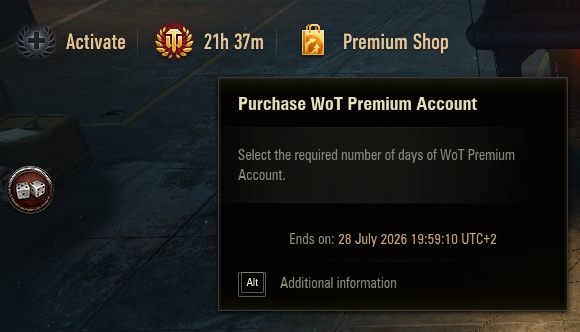

# Zanju's Premium Time

### This mod shows precisely how much premium time you have left.

The game's own Premium Account header button only shows a day count — `1 d` tells you nothing, it could be 23 hours or 15 minutes. This mod improves the existing UI:

- **Header counter** — the header button shows a timer that gets more precise as time runs out: it keeps the two largest units, so `3d 05h` with days left and `5m 12s` in the final hour. When premium is not running, the button keeps the game's default label.
- **Tooltip end time** — the button's hover tooltip gains the exact end date and time, to the second, with the UTC offset.

## Translations

Reference language `en` defines 5 strings. Translations are community-maintained and may lag behind; see [Translating](../../docs/translating.md) to add or update one, then regenerate this table with `zwm lint i18n`.

| Language | Coverage | Missing |
| --- | --- | --- |
| `pl` | 100% (5/5) | 0 |

## Install And Use

If you already have the prepared mod zip file, follow the general install path in
[Installing Mods](../../docs/installing-mods.md).

## Build From Source

For the general build/toolchain workflow, see
[Building From Source](../../docs/building-from-source.md).

## Develop

For the wider repository workflow, see:

- [Developing Mods](../../docs/developing-mods.md)
- [Architecture](../../docs/architecture.md)
- [Technical Reference](../../docs/reference/README.md)
