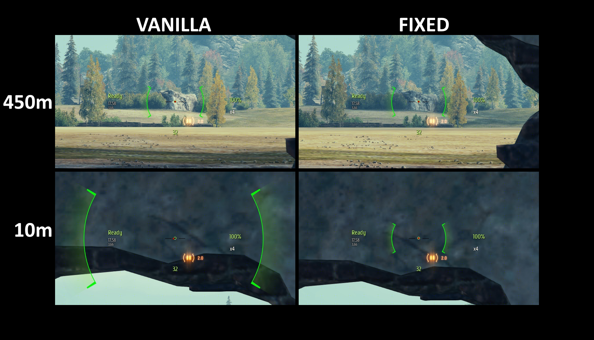

# Zanju's Salvo Reticle Fix

### This mod removes the accuracy obfuscation from the salvo mode vehicles.

On every vehicle in the game, reticle size is directly related to current dispersion. However, on vehicles which have the **Salvo Fire Mode** (_at the time of writing only the [FV230 Canopener](https://worldoftanks.eu/pl/tankopedia/21841-GB142_FV230_Canopener/) line and related premium vehicles_) when the said salvo mode is engaged, size of the reticle is modified by a hidden `gunMarkerOffset` value. This obfuscates the actual size of the reticle depending on the distance to the aiming point, which is unlike any other vehicle type in the game. This mod removed this obfuscation, so that reticle in salvo mode shows its real size and lets the player judge the accuracy properly.

## Install And Use

If you already have the prepared mod zip file, follow the general install path in
[Installing Mods](../../docs/installing-mods.md).

## Build From Source

For the general build/toolchain workflow, see
[Building From Source](../../docs/building-from-source.md).

## Develop

For the wider repository workflow, see:

- [Developing Mods](../../docs/developing-mods.md)
- [Architecture](../../docs/architecture.md)
- [Technical Reference](../../docs/reference/README.md)
